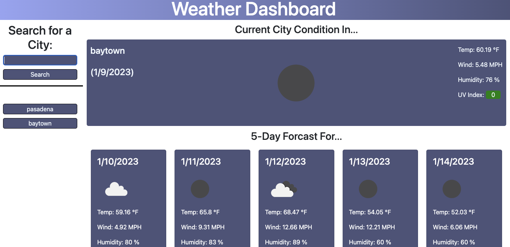

# Weather-Dashboard

## Purpose
This project was made to search a city name within USA to find the city and its current weather and its 5 day forcast. it will include a city name, date, weather icon, temprature, wind speed, humididty percentage, and a uv index with color to show severity from favorable to severe.

## Built With
* HTML
* CSS
* JavaScript

## Website
https://itzamary.github.io/Weather-Dashboard/

## Website Image
